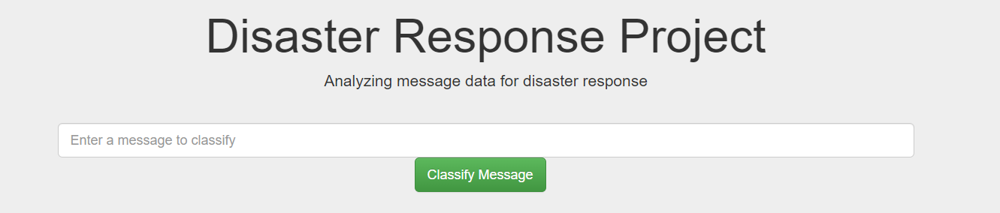
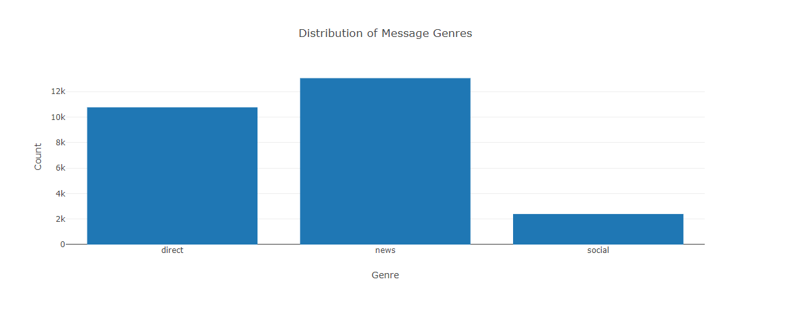
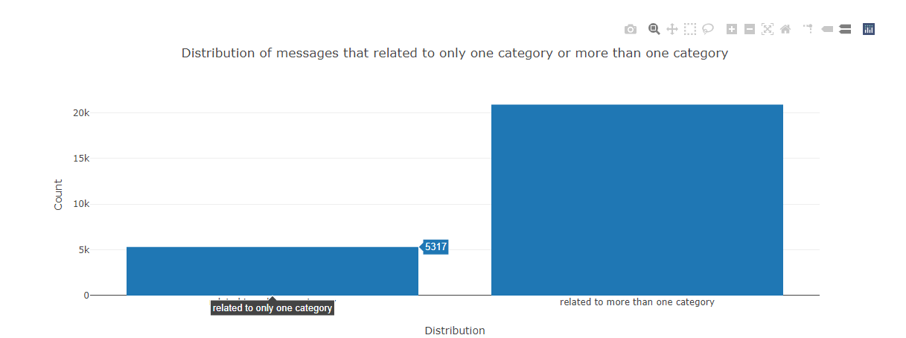

# Disaster Response Pipeline Project
## by (Khalid Alhargan)

## Dataset
In this project we used a data set containing real messages that were sent during disaster events. We created a machine learning pipeline that categorize these events so that you can send the messages to an appropriate disaster relief agency.
This project include a web app where an emergency worker can input a new message and get classification results in several categories. The web app will also display visualizations of the data.

## Project components

 There are three components we covered in this project (ETL pipeline, ML pipeline, Flask Web App).

## Files demonstration 
1. app
   - template ( web HTML pages )
      - master.html ( web HTML page )
      - go.html ( web HTML page )
   - run.py ( Web app )
2. data 
    - disaster_categories.csv ( file contains data of categories )
    - disaster_messages.csv ( file contains data of messages )
    - process_data.py ( code of data processing )
3. models
    - train_classifier.py ( code of building the model )

## ETL pipeline 
ETL pipeline at 'process_data.py' file and its been coded to do this thing:
- loading two dataframes from the files at data folder and merge them togather to do processing later.
- do steps of cleaning to the merged dataframe.
- after the cleaning is finished the datafram will be saved in database for modling later

## ML pipeline 
ML pipeline aaat 'process_data.py' file and its been coded to do this thing:
- loading the dataframe that been saved at ETL pipeline.
- do steps of NLP processing to the dataframe.
- after the NLP processing is finished then the peocess of duilding the model and train it will start
- after training is finished the model will be evaluated and saved
## Flask Web App
We used provided  flask web app form Udacity (with some modification).

- we did modify file paths for database and model as needed
- We add Bar and Pie data visualizations using Plotly in the web app.

## Instructions:
1. Run the following commands in the project's root directory to set up your database and model.

    - To run ETL pipeline that cleans data and stores in database
        `python data/process_data.py data/disaster_messages.csv data/disaster_categories.csv data/DisasterResponse.db`
    - To run ML pipeline that trains classifier and saves
        `python models/train_classifier.py data/DisasterResponse.db models/classifier.pkl`

2. Run the following command in the app's directory to run your web app.
    `python run.py`

3. Go to http://0.0.0.0:3001/

## Acknowledgments
I would like to thank Udacity for this project, It was fun and useful at the same time.
And I would like to thank my friends for thier help.

